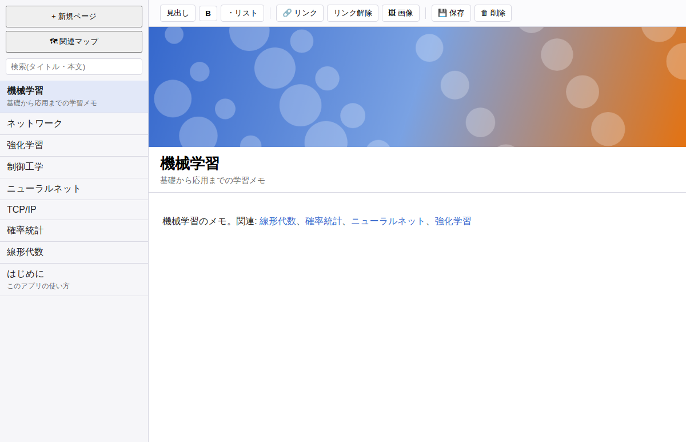
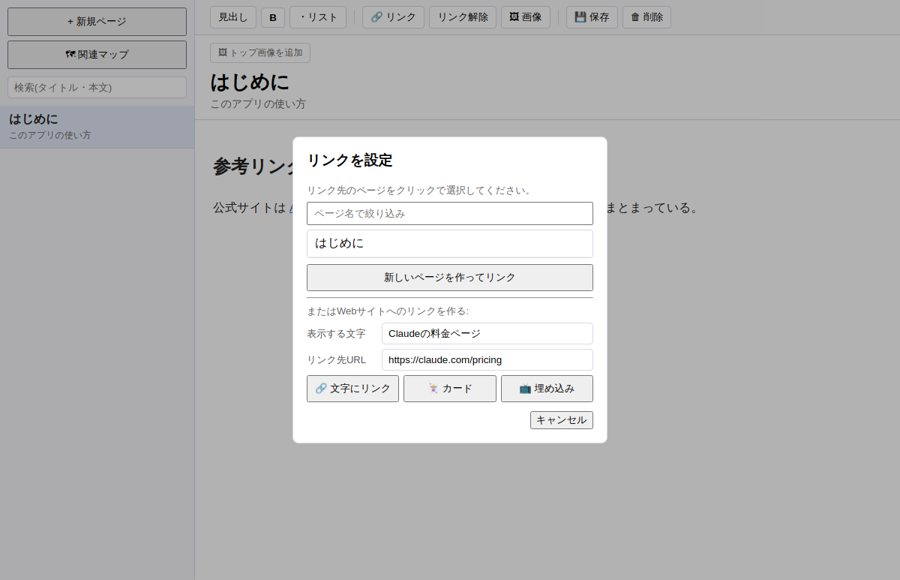
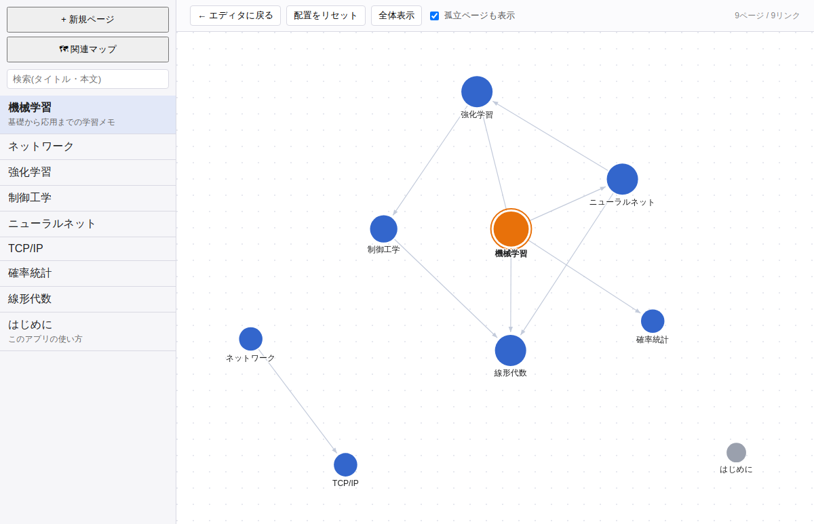

# Memo Wiki

Wikipediaのように、メモ同士をリンクでつなげられるメモ帳アプリです。

「あの話は、たしか別のメモに書いたはず」と探し回る手間を減らしたくて作りました。
書いたメモをリンクでつないでいくと、知識のつながりをあとから図で確かめられます。

リンクを貼るときも画像を入れるときも、記号や書き方を覚える必要はありません。
どの操作も、ボタンを押すか貼り付けるだけで済みます。



---

## できること

文字を選んでボタンを押すと、その文字が別のメモへのリンクになります。
Webサイトへのリンクは、文字に埋め込む形と、見出し画像つきのカードの形から選べます。
YouTubeなどの動画URLを貼ると、サムネイル付きの動画カードになり、クリックするとブラウザで再生できます。
画像は、ファイルを選ぶ、コピーして貼り付ける、ドラッグして落とすのどの方法でも入れられます。

ページの一番上には大きな画像を置けて、見出しや太字、箇条書きも使えます。
Wikipediaのような目次も入れられ、目次は見出しから自動で作られます。目次の項目をクリックすると、その場所へ移動します。

どのメモがどのメモとつながっているかは、地図のような図で一覧できます。
検索はタイトルと本文の両方が対象です。
別のメモに移ると自動で保存されるので、保存し忘れる心配はありません。

ほかに、すべてのメモをブラウザで読める形でフォルダに書き出す機能と、どのメモからも使われていない画像を探してごみ箱へ移す機能があります。
使い方は、左下の「?」ボタンを押せばアプリの中でいつでも読めます。

---

## インストール

1. [Releasesのページ](../../releases/latest)を開きます
2. `MemoWiki-Setup-○○○.exe`をクリックしてダウンロードします
3. ダウンロードしたファイルをダブルクリックします
4. 確認画面が出るので、内容を確かめて進めます。インストール先もここで選べます

インストールが終わると、デスクトップとスタートメニューにアイコンができています。
確認画面が出るのは初回だけで、次回からの更新は自動で行われます。

> **「WindowsによってPCが保護されました」と出たとき**
>
> この注意画面は、Windowsが見慣れないアプリを起動するときに表示されます。
> 「詳細情報」をクリックし、表示された「実行」ボタンを押すと先へ進めます。
> 2回目からは表示されません。

対応しているOSはWindowsです。

---

## 使い方

> 使い方に迷ったら、画面の左下にある「?」ボタンを押してください。この使い方をアプリの中でいつでも読めます。

### メモを書く

左上の「+ 新規ページ」で新しいメモを作ります。
上の欄にタイトルを、その下に本文を書きます。
タイトルの下の細い欄に一行の説明（サブタイトル）を書いておくと、左の一覧に表示されるので、メモを見分けるのに便利です。

### メモ同士をつなぐ

1. つなげたい文字をドラッグして選びます
2. 上の「リンク」ボタンを押します
3. 表示された一覧から、つなげたいメモをクリックします

まだ存在しないメモにつなぎたいときは、「「〇〇」で新しいページを作ってリンク」を押してください。その名前のメモが作られ、同時にリンクも貼られます。

リンクを貼った文字は青くなり、クリックするとリンク先のメモに移動します。

### Webサイトのリンクを貼る

Webサイトへのリンクを貼るのは、同じ「リンク」の画面の下半分です。



「表示する文字」と「リンク先URL」を入れてから、次のどれかのボタンで貼り方を選びます。

| ボタン | 貼ったあとの表示 |
| --- | --- |
| 文字にリンク | 文字が青くなり、クリックするとブラウザで開きます |
| カード | サイトのタイトル・説明・画像を自動で取得し、カードの形で貼ります |
| 動画・埋め込み | 動画のURLなら動画カードになり、それ以外のページはメモの中に表示されます |

貼ったあとで直したいときは、Ctrlキーを押しながらクリックしてください。

| 対象 | 直せる内容 |
| --- | --- |
| 文字のリンク | 表示する文字とリンク先を変えられます。「リンクを解除」を押すと文字だけが残ります |
| カード・動画・埋め込み | リンク先を差し替えられます。「削除」を押すとそのかたまりごと消えます |

### 動画を貼る

YouTubeなどの動画URLを「リンク先URL」に入れて「動画・埋め込み」を押すと、サムネイルと▶の付いた動画カードになります。
動画カードをクリックすると、その動画がブラウザで開いて再生されます。

> **動画をメモの中で直接再生できない理由**
>
> YouTubeは、動画を埋め込んだサイトがどこかによって再生を許可するかどうかを決めています。
> パソコンの中で動くアプリには、その条件を満たす手段がありません。
> 以前のバージョンで表示されていた「動画プレーヤーの設定エラー（エラー153）」は、これが原因でした。
> どう工夫しても埋め込んだままでは再生できないため、確実に見られる動画カードの形に変えました。
>
> サムネイルはメモと一緒に保存されます。あとからメモを開いたときに通信は起きず、インターネットにつながっていなくても表示されます。

### 目次をつける

長いメモには、目次をつけておけます。

1. 文章を「大見出し」と「小見出し」で区切ります
2. 目次を置きたい場所にカーソルを合わせ、上の「目次」ボタンを押します

目次は見出しから自動で作られます。あとから見出しを増やしたり書き直したりしても、目次も自動で追従します。
項目をクリックすると、その見出しの場所まで移動します。

### 画像を入れる

画像は次のどの方法でも入れられます。

- 上の「画像」ボタンを押してファイルを選ぶ
- 画像をコピーして、本文でCtrl + Vを押す（スクリーンショットもそのまま貼れます）
- 画像ファイルを本文へドラッグして落とす

### ページの一番上に大きな画像を置く

タイトルの上にある「トップ画像を追加」を押して画像を選びます。
画像を置いたあとは、画像の上にマウスを乗せると、右下に「画像を変更」と「削除」のボタンが表示されます。

### つながりを図で見る

左上の「関連マップ」を押すと、メモ同士のつながりが図で表示されます。



図の中の丸がひとつのメモを表し、丸をクリックするとそのメモが開きます。
矢印はリンクの向きです。たくさんのメモとつながっているメモほど、丸が大きく描かれます。
灰色の丸は、まだどのメモともつながっていないメモです。

丸はドラッグで動かせます。マウスのホイールで拡大と縮小ができ、何もない場所をドラッグすると図全体を動かせます。

### 探す

左上の検索欄に文字を入れると、タイトルと本文の両方が検索の対象です。

### 保存

別のメモに移るときに自動で保存されます。
すぐに保存したいときは、「保存」ボタンを押すか、Ctrl + Sを押してください。

---

## 更新について

新しいバージョンが出ると、アプリが自動で見つけて準備します。
準備ができると画面の右下に案内が表示されるので、「再起動して更新」を押せば更新は完了です。
セットアップ画面は表示されず、そのまま新しいバージョンで起動します。

案内が出てすぐに押さなくてもかまいません。次にアプリを閉じたときに、自動で新しいバージョンになります。
書きかけのメモがあるのに、アプリが勝手に再起動することはありません。

更新後に初めてアプリを開くと、そのバージョンで変わった点が表示されます。
しばらく更新していなかった場合は、その間の変更を古いものから順に表示します。

今のバージョンの番号は画面左下にあります。
その隣の「更新を確認」を押すと、新しいバージョンが出ていないかをその場で確認できます。

---

## メモの保存場所

メモはあなたのパソコンの中だけに保存され、どこかへ送信されることはありません。

保存場所は次のフォルダです。エクスプローラーのアドレス欄に貼り付けると開けます。

```
%APPDATA%\memo-wiki\data
```

この`data`フォルダをコピーしておけば、それがそのままバックアップになります。
別のパソコンで使うときは、同じ場所にこのフォルダをコピーすれば、メモをそのまま引き継げます。

アプリを更新してもメモは消えず、アンインストールしても残ります。
さらに、更新のたびに念のためバックアップが自動で作られ、`%APPDATA%\memo-wiki\backups`に最新5回分が残ります。

### 書き出す

画面左下の「データ」から「書き出し先のフォルダを選ぶ」を選ぶと、すべてのメモを好きなフォルダに書き出せます。

書き出したフォルダの`index.html`をブラウザで開くと、メモを読めます。リンクや目次もそのまま使えます。
一緒に書き出される`data`フォルダは、アプリのデータそのものです。
このフォルダで`%APPDATA%\memo-wiki\data`を置き換えると、メモを書き出した時点の状態に戻せます。

---

## 困ったときは

**Q. 起動しようとしたら青い警告画面が出ました**

「詳細情報」を押してから「実行」を押してください。詳しくは[インストール](#インストール)の注意書きに書いてあります。

**Q. 貼ったリンクやカード、埋め込みを消したい、または直したい**

Ctrlキーを押しながらクリックすると、編集画面が表示されます。
カードや埋め込みは、その画面の「削除」で丸ごと消せます。
Ctrlキーを押さずにクリックするとリンク先が開いてしまうので、必ずCtrlキーを押しながらクリックしてください。

**Q. YouTubeの動画で「動画プレーヤーの設定エラー（エラー153）」が表示されます**

バージョン1.8.4から、動画は埋め込みではなく動画カードとして貼るように変わりました。そのため、このエラーはもう表示されません。
画面左下の「更新を確認」から、最新版に更新してください。

すでに貼ってある動画は、そのメモを開いたときに自動で動画カードに置き換わります。置き換わったあとにメモを保存すると、変更が確定します。

なお、動画をメモの中で直接再生することはできません。
YouTubeは動画を埋め込んだサイトがどこかによって再生を許可するかどうかを決めており、パソコンの中で動くアプリにはその条件を満たす手段がないためです。
動画カードをクリックすれば、ブラウザでふつうに再生できます。

**Q. 埋め込んだWebページが真っ白のまま表示されません**

そのサイトが、ほかのアプリの中に表示されることを禁止している場合があります。
その場合は埋め込みでは表示できないので、代わりに「カード」で貼ってください。

**Q. Webページからコピーしたら、色やレイアウトが変わってしまいました**

安全のため、外から貼り付けた文章の色や文字の大きさといった見た目の指定は取り除いています。
見出し・箇条書き・表・リンク・画像といった中身はそのまま残ります。

**Q. メモの中のカードや動画、埋め込みを、別のメモにも置きたい**

バージョン1.8.3以降では、コピーして貼り付けるとそのまま別のメモへ移せます。

**Q. 間違えてメモを消してしまいました**

`%APPDATA%\memo-wiki\backups`の中に、更新した時点のバックアップが残っている場合があります。
その中のファイルを`data`フォルダに戻すと、メモを復元できます。

**Q. トップ画像を消したあとも、画像のファイルは残っていますか**

残っています。あとから元に戻せるように、あえてファイルは消さないようにしています。
容量が気になるときは、画面左下の「データ」から「使っていない画像を探す」を選んでください。どのメモからも使われていない画像を、まとめてごみ箱へ移せます。この機能はバージョン1.9.0以降で使えます。

---

## 安全性とプライバシー

このアプリが何をしていて、何をしていないのかは、[SECURITY.md](SECURITY.md)に書いてあります。

要点は次のとおりです。

メモの内容はあなたのパソコンの中だけに保存され、どこにも送信されません。
アプリがインターネットに接続するのは、次の3つの場面に限られます。

- リンクや動画を貼るとき。そのサイトの見出しとサムネイルを1回だけ取得します
- ページを埋め込んで表示するとき
- 新しいバージョンが出ていないかを確認するとき

カードや動画のサムネイルは、取得したときにメモと一緒に保存します。そのため、あとでメモを見返すときに相手のサーバーへ通信することはありません。

このアプリの正しい入手先は、このページのReleasesだけです。ほかの場所で配られているものは使わないでください。

---

## ライセンス

Copyright (C) 2026 Nez

このアプリはフリーソフトウェアで、GNU General Public License v3.0以降のもとで公開しています。全文は[LICENSE](LICENSE)にあります。

だれでも自由に使えて、中身のコードを読むことも、改造して配ることもできます。
ただし、改造したものを配るときは、改造後のコードも同じ条件で公開しなければなりません。

---

## 開発者の方へ

動かし方やビルド方法、コードの構成は[DEVELOPMENT.md](DEVELOPMENT.md)にまとめています。
